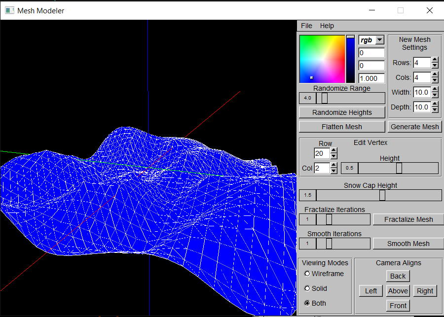

# 3D Mesh Modeler



**Software for creating and editing 3D models. Includes the ability to fractalize and smooth meshes.**

MeshModeler is a 3D Modeler for creating and editing meshes. As well as general
editing of vertices heights and colors, MeshModeler includes the ability to 
both fractalize and smooth a mesh. Created meshes can then be exported as an 
OBJ and MTL files for editing in other 3D modeling software, use in games, and 
other applications.

Requires the FLTK libraries and the system path variables to compile 
(look in project setting for the system variable names).

## Instructions

To use this 3D Modeler open the program and a new mesh with randomized 
heights will be generated. To create a new mesh use the spinner widgets to 
select the number of rows and cols in the new mesh and the width and depth of 
the mesh. Click on the "Generate Mesh" button to create the a new mesh with
the specified settings. You can also change the color of the mesh with the color
chooser. This will change the color of the current mesh and of any new meshes.
Note that the wire frame is always drawn as white.

To change the viewing mode to wire-frame, solid, or both use the 
corresponding radio buttons in the "Viewing Mode" group. This will change how 
the mesh is drawn.

Use the following controls to move the camera around the sphere it lies on:

```
Rotate UP:       W
Rotate LEFT:     A
Rotate DOWN:     S
Rotate RIGHT:    D
Roll LEFT:       Q
Roll RIGHT:      E
Increase Radius: Ctrl
Decrease Radius: Shift
```

Note that you may have to click off of any selected input boxes for these 
commands to register. Also, you may use the "Camera Align" group to move the 
camera to predefined positions on a sphere of radius 15.

To edit the vertices height values in the mesh select a vertex and use the
height slider to change the selected vertex's height. To select a vertex you can
either click on a vertex in the GL window and it will select the nearest vertex 
within a pre-set radius of 0.5, or you can use the "row" and "col" spinners to 
select the specific vertex desired. Either method will allow you to select any
vertex on the mesh and after being selected an orange wire-frame square will 
appear around the vertex indicating that it is selected.

The heights of the current mesh can also be randomized or flatten if 
desired. To do this use the corresponding buttons and slider to change the 
random height range. This will not create a new mesh but will instead change the
current mesh's height values.

Use the "Snow Cap Height" slider to edit the height at which the vertices 
are drawn white. This can be used to simulate a mountain range with the 
fractalize button modifying the mesh to look more mountainous.

To fractalize the mesh use the "fractalize iterations" slider to change the
number of iterations the fractalize algorithm runs. Click the "Fractalize Mesh"
button to run the algorithm the specified number of times.

Similarly, use the "Smooth Iteration" slider and "Smooth Mesh" button to 
run the smoothing, Catmull-Clark Subdivision, algorithm on the mesh. This will
smooth out the mesh and create smooth curve-like structures.

Lastly, to save the mesh to a OBJ file click on "File"->"Save". This will 
bring up a explore window for selecting the file location and name. Make sure to
add the extension ".obj" to the filename. Once done, click "OK" to save. The 
mesh will then be saved out to a OBJ file with a MTL file for the color of each 
face. This file can be imported to many different 3D modelling software 
including Autodesk's Maya and the open source MeshLab.

## Design Choices

For the most part the code is designed to be short and contained. In order 
to do this many classes and Fl_Widgets are implemented to represent data 
discreetly. The Mesh is a standard 2-dimensional vector of vec4's for the 
vertices. This allows for the simple representation of a mesh by just its 
vertices which are drawn as edges and/or faces in the draw method.

There are also sub-classes of the Fl_Group class for the widgets used in the
MeshModeler. This allows for simpler more readable code in the MeshModeler as 
well as independent objects. This adheres to the object oriented concept of 
encapsulation by grouping similar code together to form a discreet object.

The GL3DWindow has the ability to represent a selected index of the mesh 
contained within it. This is needed so the GL3DWindow can draw the selection 
square. While this does break some of the encapsulation and discreet object 
concepts, this is only an optional ability and therefore the GL3DWindow, can be
used without vertex selection.

As far as the callbacks are concerned, the callback functions live within 
the class that it best edits. For example the GL3DWindow, has a callback 
function for setting the camera to default viewing angles. This function uses 
a switch on the buttons enumerated viewing angle.

For simplicity and reliability some of the widgets contain enumerations for 
there different options. This allow the class to work without any mysterious 
number inputs or by using string evaluations.

For both the fractalize and the smooth algorithms the mesh is copied into a 
new mesh. This is an easier method than changing the grids size and then 
shifting the vertices around. Overall the methods were intended to be optimized
and have the least complexity as possible.

Lastly, for exporting the mesh as and OBJ file, the faces are colored rather
than the vertices because of the OBJ file formats limitations. OBJ files do not
support vertex coloring but they can be extended with MTL, material, files to 
include colors for the faces. This is how the current exporting is implemented,
with two files being saved, the OBJ file and the MTL file.

	
## Known Bugs

If the user has selected an input box the controls for the camera will be 
sent to the selected input and therefore will not effect the camera position.
To fix this click on the GL window or a button to change the focus to the 
MeshModeler and use the camera controls.
